# あやめのフォルダ構成

```mermaid
flowchart TD
    root[kanji-yomi-test]

    root --> app[app<br/>画面・API]
    app --> page[page.tsx<br/>受験画面]
    app --> layout[layout.tsx / globals.css<br/>共通レイアウト・装飾]
    app --> admin[admin/<br/>管理画面]
    app --> api[api/<br/>ログイン・採点・成績API]

    root --> lib[lib/<br/>共通ロジック]
    lib --> questions[questions.ts<br/>問題データ]
    lib --> answers[question-answers.ts<br/>正解読みの処理]
    lib --> auth[student-auth.ts / admin-auth.ts<br/>認証処理]

    root --> db[db/<br/>D1接続・テーブル定義]
    root --> drizzle[drizzle/<br/>DB変更履歴]
    root --> tests[tests/<br/>自動テスト]
    tests --> rendered[rendered-html.test.mjs<br/>画面・ルート確認]
    tests --> logic[quiz-logic.test.mjs<br/>問題・モード・採点・認証確認]
    root --> worker[worker/<br/>Cloudflare実行入口]
    root --> public[public/<br/>画像・静的ファイル]
    root --> openai[.openai/<br/>公開サイト設定]
    root --> package[package.json<br/>コマンド・依存関係]
    root --> vite[vite.config.ts<br/>ビルド設定]
    root --> readme[README.md<br/>説明書]

    classDef root fill:#e0ecff,stroke:#155eef,stroke-width:2px;
    classDef folder fill:#eef4ff,stroke:#84adff;
    classDef file fill:#f8fafc,stroke:#cbd5e1;
    class root root;
    class app,lib,db,drizzle,tests,worker,public,openai folder;
    class page,layout,admin,api,questions,answers,auth,rendered,logic,package,vite,readme file;
```

## 主な役割

- `app/`：利用者画面、管理画面、API
- `lib/`：問題・正解判定・認証などの共通処理
- `db/`：成績やアカウントを保存するD1の定義と接続
- `drizzle/`：データベースの変更履歴
- `tests/`：自動テスト
- `worker/`：Cloudflare上で動く実行入口
- `public/`：画像などの静的ファイル
- `.openai/`：公開サイトの設定
