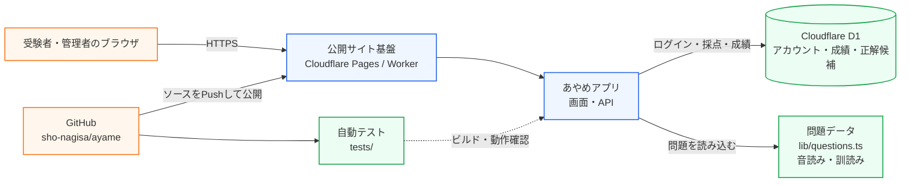

# あやめのシステム構成図

## この図が示す範囲

- `ユーザー → 公開サイト`：ブラウザからHTTPSで利用
- `公開サイト → アプリ`：画面とAPIを実行
- `アプリ → D1`：アカウント、受験結果、回答、正解候補を保存・取得
- `GitHub → 公開サイト`：ソースをPushした状態を公開用ビルドとして反映
- `tests`：問題数・出題モード・採点・認証・画面構成を確認
